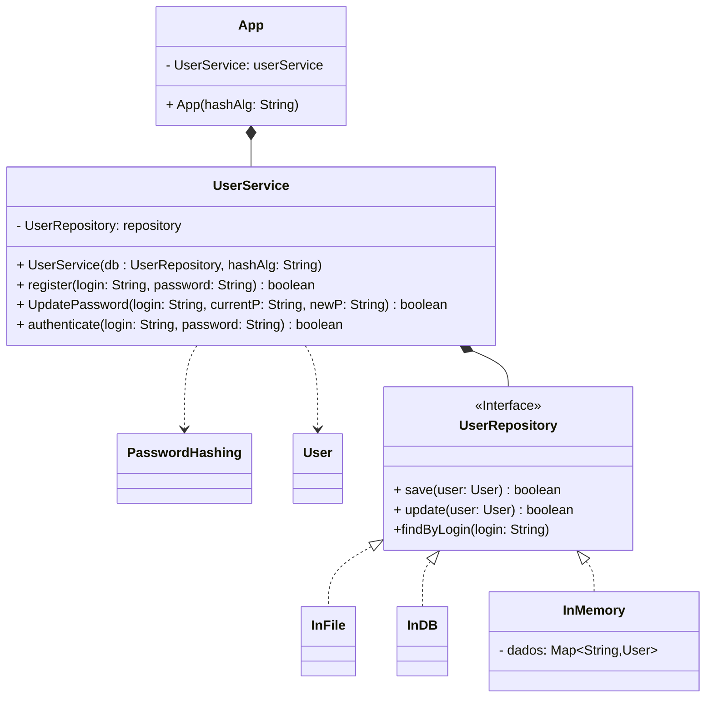

```mermaid

classDiagram
direction TB
    class PasswordHashing
    class App{
        - UserService: userService
        + App(hashAlg: String)
    }
    class User
    class UserService{
        - UserRepository: repository
        + UserService(db : UserRepository, hashAlg: String)
        + register(login: String, password: String) boolean
        + UpdatePassword(login: String, currentP: String, newP: String) boolean
        + authenticate(login: String, password: String) boolean
    }
    class UserRepository{
        <<Interface>>
        + save(user: User) boolean
        + update(user: User) boolean
        +findByLogin(login: String)
    }
    class InMemory{
        - dados: Map~String,User~
    }

    UserRepository <|.. InFile
    UserRepository <|.. InDB
    UserRepository <|.. InMemory
    App *-- UserService
    UserService ..> User
    UserService *-- UserRepository
    UserService ..> PasswordHashing

```